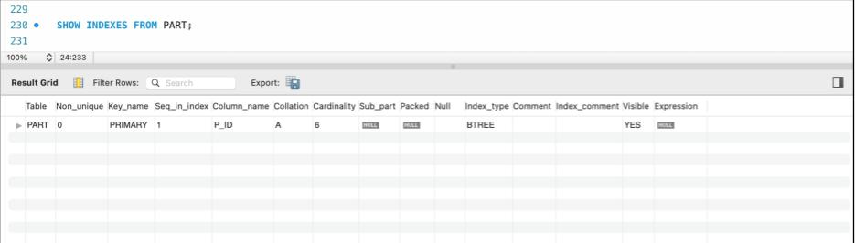
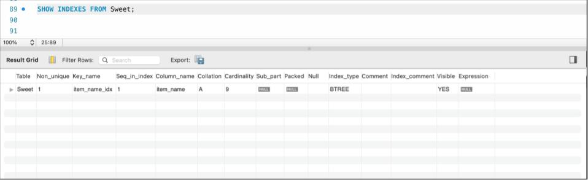
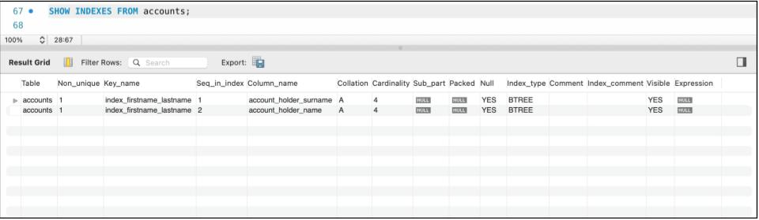
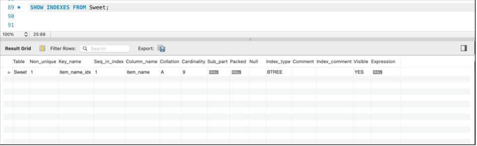
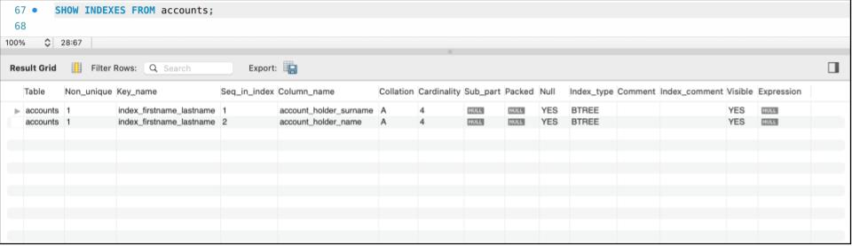

#HOMEWORK 2

ISOBEL GLADMAN

##TASK 1 (SQL)

MySQL Index

NOTE: this is a very common question in tech interviews. 
The most important index types we need to know about are:
* Single column and multi-column index
* Composite index
* Clustered index

Write definitions for each type and provide an example (you can find examples online, but you need to write them down for each type)

---
An index is a way of speeding up queries against a table. Because tables are often filled with data in an ad hoc manner, it means that the data in them is often not ordered in an easily parsable way. If you query against a table for, say, lastName = ‘Smith’, the processor has to check each and every record’s lastName value against ‘Smith’. This could take a long time if you have millions of rows of data! An index works as a ‘support’ table to your main table, by going through the table and recording references to where particular bits of data sit in a table. 

Take the real-life example of a biology textbook. Let’s say you wanted to look up the topic of cell division. Now you could read every page in the textbook until you get to the pages regarding cell division, but this might take a long time. Instead, textbooks usually have an index in the back, which is indexed by topics. So each topic is ordered alphabetically, with the relevant page numbers next to them. This is an example of a non-clustered index, because the data is not ‘clustered’ next to the index - the data (i.e. the actual textbook pages) is separate from the index (at the back of the book, in a separate section).

Contrast that with the real-life example of a phone book. Phone books are already organised alphabetically by last name, starting with surnames beginning with A and going through the alphabet. Each name has a phone number attached to them. Let’s say you wanted to look up the number for your friend Charlie, last name Jones. This time, you would just head to the part of the book where you thought the Js would be (J for Jones), flipping forward if you had landed on a page before the Js, or backwards if you had landed on a page after the Js. There’s no need for a separate index, because the phonebook is already indexed (by last name, alphabetically). This is an example of a clustered index. 

In database terms, a clustered index describes when a table is already ordered by a set of unique values, such as by a primary key. Practical DB examples of this might include columns that have ID numbers in them, as every record should have its own unique ID number. Essentially, in MySQL, when you set a column as a primary key, you are by default creating a clustered index on that primary key. 

Here is an example of a clustered index on the primary key on the table ‘PART’ in the database ‘parts’:

A single-column index is when you put an index on a single column. You can create a single-column clustered index by creating a table when the primary key is only on one column.

A single-column non-clustered index would be where you are creating an index on a column that is not the primary key. For example, if you created an index on lastNames, ordering them in ascending order, that would mean the index creates a record of all of the lastName values in ascending order, and then a corresponding reference back to the original table, to show where that value can be found. When querying an attribute that has been indexed e.g. querying lastName = ‘Smith’ when lastName has been indexed, the processor heads to the index, and is able to find ‘Smith’ much more easily, as the index has stored the data in ascending order. When it finds ‘Smith’, it can then look at the corresponding reference back to the original table, and then go to the original table and find the entry for ‘Smith’ there at the point referenced. 

An example of the code for creating a single-column index would be:

``CREATE INDEX single_col_index_name ON table_name(column_name)``

Here is an example of a single-column non-clustered index on the ‘Sweet’ table in the database ‘Bakery’:

A multi-column index, also known as a composite index, is when an index is put against multiple columns. If you have a composite primary key on a table, you will be creating a multi-column clustered index.

A multi-column non-clustered index is where you place a multi-column index that contains at least one column that is not the primary key. Take the lastName example we have been working with. ‘Smith’ is a common surname in English-speaking countries, so there might be lots of Smiths in your table. If you were looking for someone called Sebastian Smith, one could benefit from the speeding-up that indexes provide, by creating an index on lastName AND another column, say, firstName. 

An example of the code for creating a multi-column or composite index would be:

``CREATE INDEX multi_col_index_name ON table_name(col1, col2, col3 etc.)``

Here is an example of a multi-column non-clustered index created on the ‘accounts’ table in the database ‘bank’:

###Add a new index to the ‘Sweet’ table in Bakery database ( any column -explain your choice)

I added a new index onto the item_name column in the Sweet table:

``CREATE INDEX item_name_idx ON Sweet(item_name);``

I put an index on the item_name column because I thought about how you might actually use the Sweet table if you worked at a bakery. I thought probably you might get asked to find information about a certain product, and people would ask for that info by the name of the product i.e. ‘How much is a cinnamon twirl?’ 

I thought it was unlikely that people would ask you about a product via their ID numbers or their prices e.g. by asking ‘How much is the item with ID number 4?’ or asking ‘What is the name of the product that costs 0.88?’
Putting the index on item_name means that, for common or regularly used queries such as via item_name, that search can be sped up. 

###Add a new index (multi-column) to the table ‘Accounts’ in the Bank database ( explain your choice of columns). 

I added a new multi-column index across the columns account_holder_surname and account_holder_name to the ‘accounts’ table:

``CREATE INDEX index_firstname_lastname ON accounts(account_holder_surname, account_holder_name);``

I chose these two columns because I thought about what data you might need to access if you were helping customers when working at a bank. You would probably be given the customer’s first name and last name and need to find the right account number and its details. You would probably want to search by account_holder_surname first, as these tend to be more unusual than first names. But because banks have hundreds of thousands of accounts in their records, there are likely to be many people with the same surname, especially where the surname is common (like ‘Smith in the examples given above). Having an index across account_holder_name as well as account_holder_surname would mean that the beneficial speediness of an index on just account_holder_surname would also apply when you are searching by both columns.

